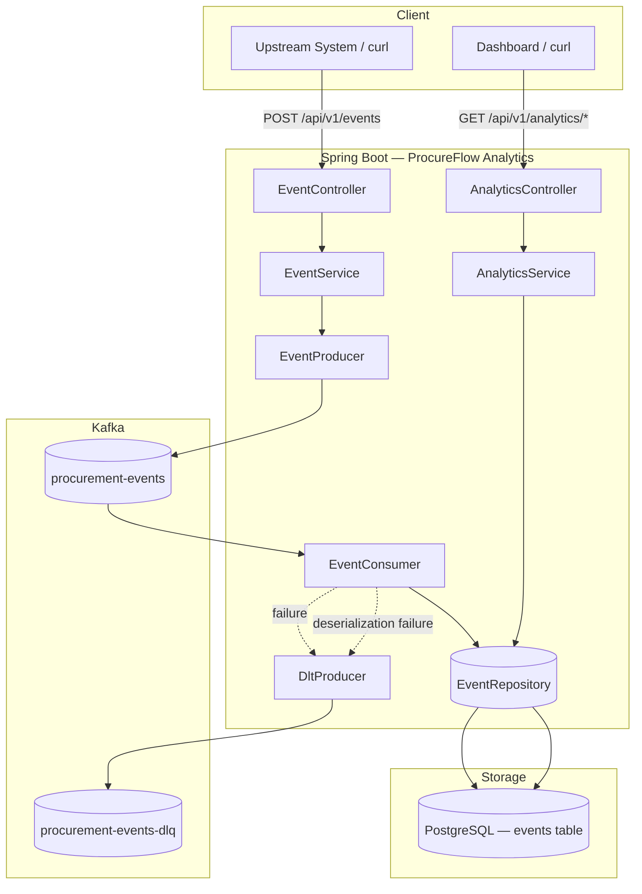
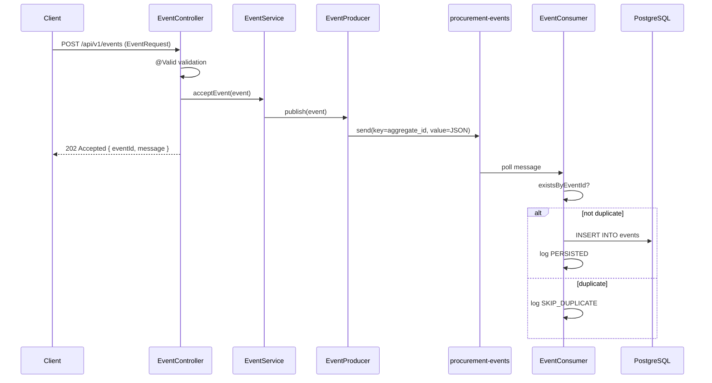
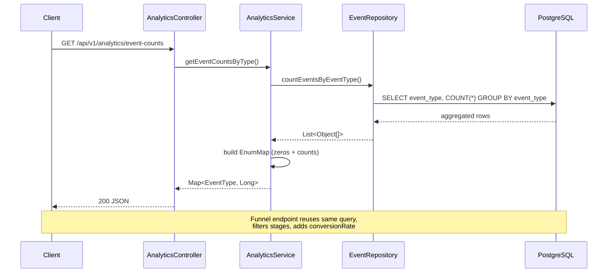
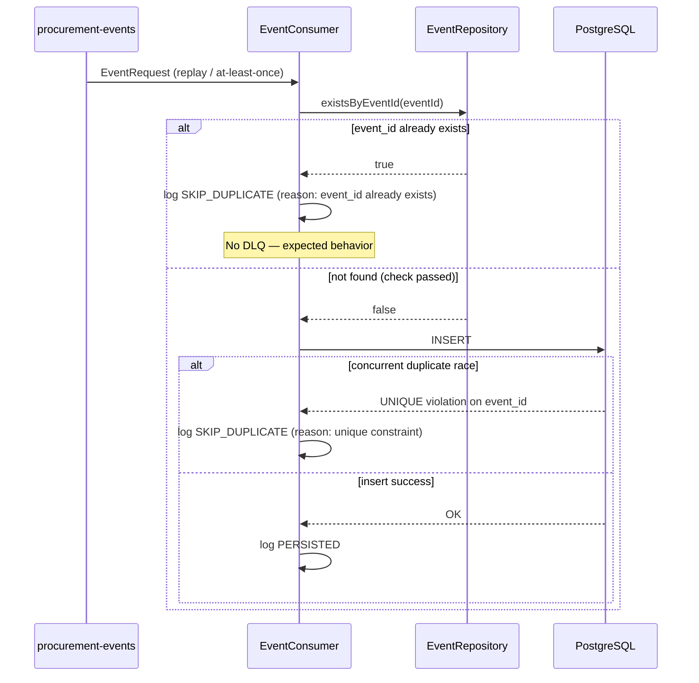
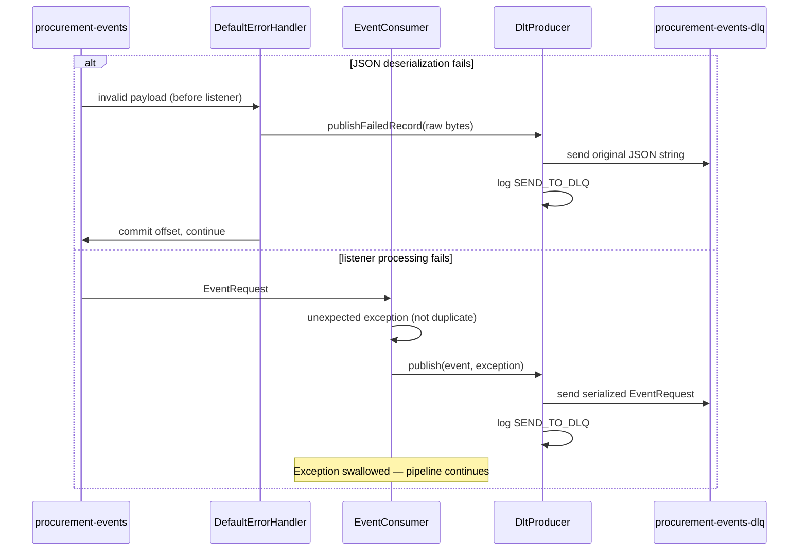

# ProcureFlow Analytics

Event-driven procurement analytics platform built with Spring Boot, Kafka and PostgreSQL.

A single application that ingests procurement lifecycle events, persists them via Kafka, and exposes SQL-backed analytics APIs.

**Stack:** Java 21 · Spring Boot 3 · Maven · PostgreSQL · Kafka · Actuator

---

## 1. Problem Statement

Procurement systems generate events across the RFP lifecycle — creation, vendor invitations, proposals, approvals, and contract awards. Teams need:

- **Reliable ingestion** of events from upstream systems without blocking on database writes
- **Durable storage** for audit and analytics
- **Real-time-ish metrics** on funnel health and event volume

This platform accepts events over HTTP, decouples ingestion from persistence using Kafka, stores all events in a single PostgreSQL table, and serves aggregation queries for dashboards — without microservices, Elasticsearch, or Redis (Phase 1–3 scope).

---

## 2. Architecture

### High-level component diagram



### Package structure

```
com.aaryaman.eventanalytics
├── config/          KafkaConfig (producer, consumer, DLQ, error handler)
├── controller/      EventController, AnalyticsController
├── service/         EventService, AnalyticsService
├── producer/        EventProducer, DltProducer
├── consumer/        EventConsumer
├── dto/             EventRequest
├── entity/          EventEntity
├── repository/      EventRepository
└── enums/           EventType
```

### Sequence diagrams

#### Event ingestion flow



#### Analytics query flow



#### Duplicate event handling flow



#### DLQ failure flow



---

## 3. Design Decisions

| Decision | Rationale |
|----------|-----------|
| **Monolith (single Spring Boot app)** | Simpler deploy, debug, and iterate for MVP; clear package boundaries allow future extraction |
| **Single `events` table** | Append-only event log is sufficient for Phase 1–2 analytics; no normalized domain tables yet |
| **Generic JSON `payload`** | Avoids typed payload classes; upstream schema can evolve without migrations per event type |
| **Kafka between HTTP and DB** | Decouples ingestion spikes from DB write latency; enables replay and multiple consumers later |
| **SQL aggregation for analytics** | PostgreSQL `GROUP BY` is correct for current scale; no Elasticsearch or cache yet |
| **202 Accepted on ingest** | HTTP acknowledges acceptance into the pipeline, not completion of persistence |
| **Partition key = `aggregate_id`** | Preserves ordering of events per RFP/procurement aggregate |
| **No Spring Retry** | DLQ handles poison messages immediately; duplicates handled via idempotency |

---

## 4. Kafka Usage

### Topics

| Topic | Purpose |
|-------|---------|
| `procurement-events` | Main event stream (HTTP → producer → consumer → DB) |
| `procurement-events-dlq` | Failed messages for manual inspection and replay |

### Producer (`EventProducer`)

- **Key:** `aggregate_id` (String)
- **Value:** `EventRequest` as JSON (`JsonSerializer`)
- **Settings:** `acks=all`, `enable.idempotence=true`, `retries=3`

### Consumer (`EventConsumer`)

- **Group:** `event-analytics-group`
- **Deserializer:** `JsonDeserializer` → `EventRequest`
- **Error handler:** `DefaultErrorHandler` with `FixedBackOff(0, 0)` — no retries, immediate DLQ routing

### Event types

```
RFP_CREATED → VENDOR_INVITED → PROPOSAL_SUBMITTED → PROPOSAL_APPROVED → CONTRACT_AWARDED
```

---

## 5. Idempotency Strategy

Kafka provides **at-least-once** delivery. The same `event_id` may arrive multiple times due to producer retries, consumer rebalance, or crash before offset commit.

**Defense layers:**

1. **Application check:** `EventRepository.existsByEventId()` before insert → log `SKIP_DUPLICATE`, return
2. **Database constraint:** `UNIQUE` on `event_id` → catches concurrent race conditions

**What is NOT a duplicate (do not skip):** malformed JSON, missing fields, unknown enum values — these go to DLQ.

**Future:** Redis idempotency at the API layer for fast duplicate rejection before Kafka publish.

---

## 6. DLQ Strategy

Messages are sent to `procurement-events-dlq` when:

- JSON deserialization fails
- Unexpected persistence or processing exceptions occur
- Any unhandled listener error (via `DefaultErrorHandler`)

**Not sent to DLQ:** duplicate events (expected replays).

**Implementation:**

- `DltProducer` publishes the **original JSON payload** as a String to the DLQ topic
- `DefaultErrorHandler` handles deserialization failures (extracts raw bytes from `DeserializationException`)
- `EventConsumer` catch block handles in-listener failures
- Offset is committed after DLQ publish so the consumer **continues processing** subsequent messages

**Operational playbook:** monitor DLQ lag → inspect message → fix root cause → replay to main topic.

---

## 7. Analytics APIs

### `GET /api/v1/analytics/event-counts`

Returns count per event type (all enum values, zero-filled):

```json
{
  "RFP_CREATED": 15,
  "VENDOR_INVITED": 12,
  "PROPOSAL_SUBMITTED": 7,
  "PROPOSAL_APPROVED": 3,
  "CONTRACT_AWARDED": 2
}
```

**Query:** `SELECT event_type, COUNT(*) FROM events GROUP BY event_type`

### `GET /api/v1/analytics/funnel`

Procurement funnel stages + end-to-end conversion rate:

```json
{
  "RFP_CREATED": 100,
  "VENDOR_INVITED": 80,
  "PROPOSAL_SUBMITTED": 50,
  "CONTRACT_AWARDED": 10,
  "conversionRate": 10.0
}
```

**Conversion rate:** `(CONTRACT_AWARDED / RFP_CREATED) × 100`, returns `0.0` when `RFP_CREATED` is 0.

**Caveat:** counts are total events per type, not distinct aggregates. One RFP with multiple vendor invitations inflates `VENDOR_INVITED`.

### Ingest API

```http
POST /api/v1/events
Content-Type: application/json

{
  "event_id": "550e8400-e29b-41d4-a716-446655440000",
  "event_type": "RFP_CREATED",
  "aggregate_id": "7c9e6679-7425-40de-944b-e07fc1f90ae7",
  "user_id": "user-123",
  "payload": { "title": "Office Supplies FY26" },
  "occurred_at": "2026-06-23T10:15:30Z"
}
```

**Response:** `202 Accepted`

```json
{
  "eventId": "550e8400-e29b-41d4-a716-446655440000",
  "message": "Event accepted"
}
```

---

## 8. Local Setup

### Prerequisites

- Java 21+
- Maven (wrapper included: `mvnw.cmd`)
- PostgreSQL 15+
- Apache Kafka (local install or Docker)

### 1. PostgreSQL

```sql
CREATE DATABASE event_analytics;
```

Update credentials in `src/main/resources/application.properties` if needed.

### 2. Kafka topics

```powershell
.\bin\windows\kafka-topics.bat --create --topic procurement-events --bootstrap-server localhost:9092
.\bin\windows\kafka-topics.bat --create --topic procurement-events-dlq --bootstrap-server localhost:9092
```

### 3. Run the application

```powershell
cd event-analytics
.\mvnw.cmd spring-boot:run
```

Health check:

```powershell
curl http://localhost:8080/actuator/health
```

### 4. Smoke test — ingest

```powershell
curl -X POST http://localhost:8080/api/v1/events `
  -H "Content-Type: application/json" `
  -d "{\"event_id\":\"550e8400-e29b-41d4-a716-446655440000\",\"event_type\":\"RFP_CREATED\",\"aggregate_id\":\"7c9e6679-7425-40de-944b-e07fc1f90ae7\",\"user_id\":\"user-123\",\"payload\":{\"title\":\"Test RFP\"},\"occurred_at\":\"2026-06-23T10:15:30Z\"}"
```

### 5. Smoke test — analytics

```powershell
curl http://localhost:8080/api/v1/analytics/event-counts
curl http://localhost:8080/api/v1/analytics/funnel
```

### 6. Verify persistence

```sql
SELECT event_id, event_type, aggregate_id, payload, occurred_at FROM events;
```

---

## 9. Future Improvements

| Area | Improvement |
|------|-------------|
| **Schema** | Flyway migrations; replace `ddl-auto=update` |
| **Idempotency** | Redis check at API layer before Kafka publish |
| **Analytics** | Distinct `aggregate_id` counts; time-range filters; materialized views |
| **Funnel** | Stage-to-stage conversion rates; include `PROPOSAL_APPROVED` |
| **Auth** | API keys or OAuth2 on ingest and analytics endpoints |
| **Observability** | Micrometer metrics (ingest latency, consumer lag, DLQ rate), distributed tracing |
| **DLQ ops** | DLQ replay tool; alert on DLQ message rate |
| **Scale** | Read replicas; pre-aggregated counters on write; partition `events` table |
| **Architecture** | Extract ingest / processor / analytics into separate services when team or load demands |

---

## 10. Interview Questions & Answers

### Architecture & design

**Q: Why use Kafka if you already have PostgreSQL?**

A: Kafka decouples ingestion from persistence. The HTTP API returns quickly after enqueueing; DB slowdown or spikes don't block producers. Kafka also gives replay, multiple consumer groups, and a durable buffer between services.

**Q: Why a single `events` table instead of normalized RFP/Proposal/Contract tables?**

A: For MVP analytics, an append-only event log is simpler and flexible. Payloads vary by event type without schema migrations per entity. Normalized tables add value when you need transactional queries per aggregate — that's a Phase 3+ concern.

**Q: Why return 202 Accepted instead of 201 Created?**

A: Persistence is asynchronous via Kafka. 202 means "accepted for processing," not "stored." The client gets acknowledgment that the event entered the pipeline.

**Q: Why partition by `aggregate_id`?**

A: All events for one procurement aggregate go to the same partition, preserving order within that RFP's lifecycle — important if downstream logic ever depends on sequence.

---

### Kafka

**Q: What happens if the consumer crashes after saving to DB but before committing the offset?**

A: Kafka redelivers the message (at-least-once). Idempotency via `event_id` prevents duplicate rows. This is why idempotency is mandatory, not optional.

**Q: What is the difference between `acks=all` and `acks=1`?**

A: `acks=1` waits for the leader only. `acks=all` waits for all in-sync replicas — stronger durability, survives broker failure without data loss.

**Q: Why `enable.idempotence=true` on the producer?**

A: Prevents duplicate messages in Kafka when the producer retries due to transient errors — exactly-once semantics per producer instance per partition.

---

### Idempotency

**Q: How do you handle duplicate events?**

A: Two layers: (1) `existsByEventId()` check before insert, (2) `UNIQUE` constraint on `event_id` for concurrent races. Both log `SKIP_DUPLICATE` and skip — never DLQ.

**Q: What's the difference between a duplicate event and a poison message?**

A: Duplicates are expected under at-least-once delivery — same valid event replayed. Poison messages are malformed or fail every processing attempt — they belong in DLQ, not idempotency skip.

**Q: Why not use Redis for idempotency?**

A: Redis gives faster API-layer dedup before Kafka. For MVP, DB uniqueness is sufficient for consumer idempotency. Redis adds infra and consistency complexity — deferred until ingest volume requires it.

---

### DLQ

**Q: Why do you need a Dead Letter Queue?**

A: One bad message shouldn't block the entire consumer. DLQ isolates failures, preserves the original payload for debugging, and lets the main topic keep flowing.

**Q: Why no retries before DLQ?**

A: Retries help transient failures (network blip). Poison messages (bad JSON, schema mismatch) fail forever — retrying wastes resources. We use `FixedBackOff(0, 0)` for immediate DLQ routing; transient DB failures could add retries later.

**Q: Should duplicates go to the DLQ?**

A: No. Duplicates are normal. Sending them to DLQ creates noise and false alerts.

---

### Analytics

**Q: Why aggregate in SQL instead of Java?**

A: The database processes millions of rows efficiently with `GROUP BY` and returns ~5 rows. Loading all events into the JVM doesn't scale and wastes memory and network.

**Q: What's wrong with the current funnel metric at scale?**

A: It counts total events per type, not unique RFPs. Multiple `VENDOR_INVITED` for one RFP inflates counts. Fix: `COUNT(DISTINCT aggregate_id)` per stage.

**Q: How would you scale analytics to millions of events?**

A: Short term: indexes, read replicas, materialized views. Long term: pre-aggregate counters on write in the consumer, or a dedicated analytics read model (CQRS).

---

### Production readiness

**Q: What's missing for production that this MVP has?**

A: Flyway migrations, authentication, secrets management, structured metrics/alerting, DLQ replay tooling, integration tests with Testcontainers, and removing `ddl-auto=update`.

**Q: How would you monitor this system?**

A: Kafka consumer lag, DLQ message rate, ingest API latency (p99), DB connection pool, error log rate by `action` field, Actuator health for DB and Kafka connectivity.

**Q: When would you split this monolith?**

A: When independent scaling (ingest vs analytics reads), separate deployment cadences, or team ownership boundaries justify the operational cost — not before.

---

## License

Internal / educational project.
